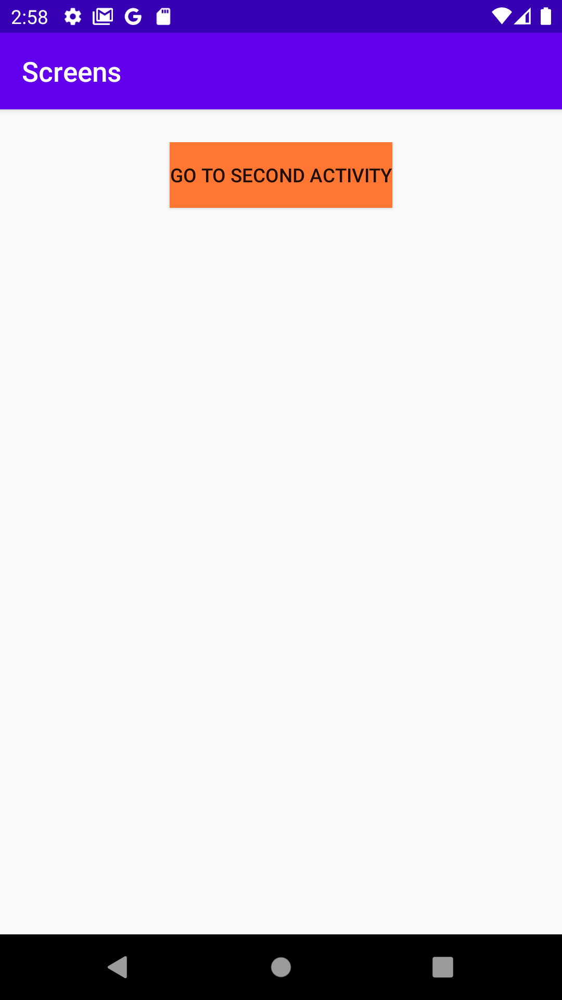
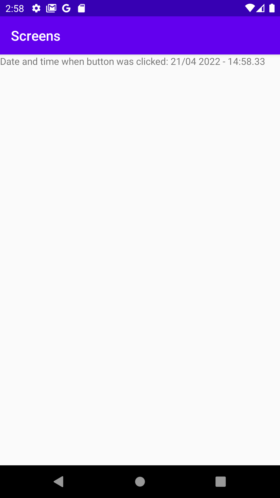

# Rapport

Programmet går ut på att visa en annan aktivitet genom att klicka en knapp. När den knappen klickas ska data skickas med till den andra skärmen och ska på något sätt presenteras. I denna app skickas data i form av datum och tid när användaren klickade på knappen. Denna data skrivs sedan ut på den andra aktiviteten. Detta går att se i bilderna nedan:





För att åstadkomma detta behövdes en ny aktivitet skapas. Denna aktivitet innehåller endas en TextView som används till att presentera den data som skickas med i intenten. Denna sparas i en private varibael och initiserades med funktionen _findByView()_, se kodblocket nedan:

```
textViewDate = findViewById(R.id.textview_date);
```

För att sedan presentera datan användes koden nedan:

```
Bundle extras = getIntent().getExtras();

if (extras == null) return;

textViewDate.setText("Date and time when button was clicked: " + extras.getString("time"));
```

Den första aktiviteten består av en knapp. Denna kör funktionen _runSecondActivity_ som går att se i kodblocket nedan:

```
public void runSecondActivity(View view) {
    currentTimeAndDate = dateFormatter.format(new Date());
    sendIntent.putExtra("time", currentTimeAndDate);
    startActivity(sendIntent);
}
```

Denna funktionen startar den andra aktiviteten med intenten som skapades tidigare i appen. Denna ident skickar med datum och tid i en string. Denna string uppdateras med den nuvarande tiden och datumet varje gång den andra aktiviteten startas.
